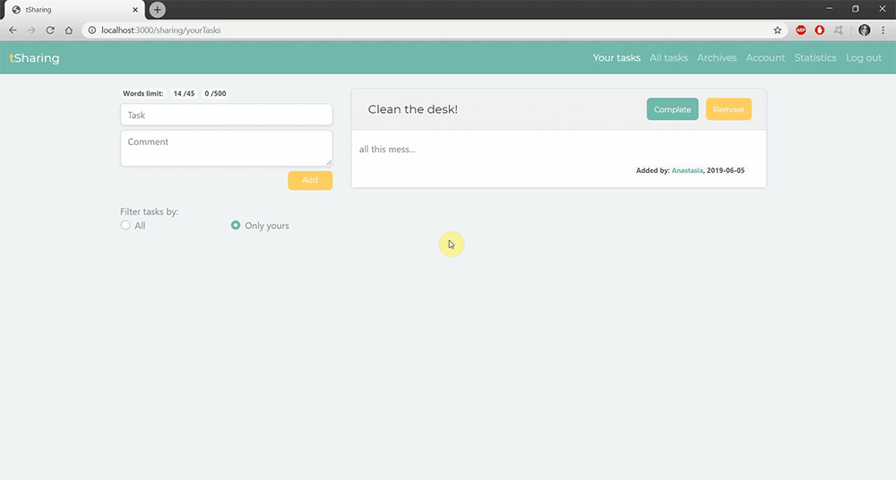

# tSharing
A web application for assigning tasks, saving time and improving team work with roommates based on Node.js + Express.js + EJS + MySQL

- <a href="https://github.com/visionmedia/express">Express.js</a>
- <a href="https://github.com/nlf/connect-mysql">Express-session</a>
- <a href="https://npmjs.org/package/mysql">MySQL</a>
- <a href="https://github.com/sequelize/sequelize">Sequelize</a>
- <a href="https://github.com/tj/ejs">EJS</a>
- <a href="https://github.com/jaredhanson/passport">Passport.js</a>
- <a href="http://getbootstrap.com/">Bootstrap</a>

Install
-- 
1. mkdir folder_name
2. cd folder_name
3. git clone https://github.com/Cailette/tSharing.git .
4. npm install
5. npx sequelize-cli db:create (make sure your MySQL server is running)
6. npx sequelize-cli db:migrate
7. npm start OR nodemon ./bin/www 
8. then load http://localhost:3000/ in your browser to access the app

Debug
--
- <a href="https://npmjs.org/package/nodemon">nodemon</a>
- npm -g install nodemon
- nodemon app.js

Unit tests
--
- <a href="https://github.com/mochajs/mocha">Mocha</a>
- npm install mocha 
- mkdir test
- npm test OR mocha --exit

Integration tests
--
- <a href="https://github.com/cypress-io/cypress">Cypress</a>
- npm install cypress --save-dev
- npm run cypress OR cypress open

Functionality
--
1. In the "Create" tab, you can create a board with a unique name and password, as well as your account. Then you can invite friends to join you by sending facebook message or e-mail.
{:height="50%"}
2. In the "Join" tab, you can join the board using the name and password from your friend and create your account.

3. In the "Login" tab, you can log in to your account associated with the board shared with your friends.

4. After logging in on the "account" tab, the user can view teammates and edit or delete the account.

5. After logging in on the "All tasks" tab, the user can see all tasks added by the board's members. User can add new task, assign any free task to himself or delete it.

6. After logging in on the "Your tasks" tab, the user can see all tasks assigned to him. User can complete or remove task from his board.
7. After logging in on the "Archives" tab, the user can see all deleted or completed tasks. The user can rate completed tasks.

8. User can filter and sort tasks in the "Archives" and "All tasks" tabs. Filter by user name and status, sort by date or title.

9. User can view statistics about the number of tasks completed, assigned and deleted on "Statistics" tab for board and selected users.

10. After logging in on the "Your tasks" tab, the user can add private tasks, filter them and after completion and removal can see them in "Archives" tab.

